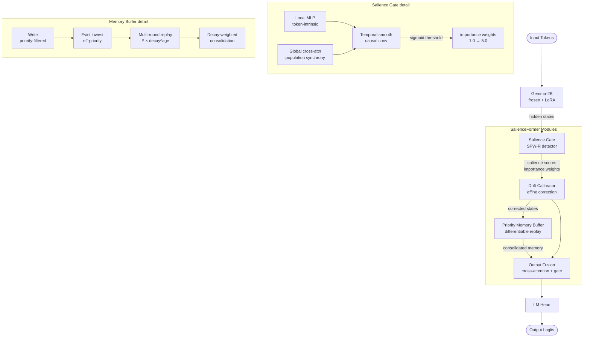

<h1 align="center">SalienceFormer</h1>

<p align="center">
  <em>Hippocampal memory selection for transformers — biologically-inspired consolidation for large language models</em>
</p>

<p align="center">
  <a href="https://huggingface.co/Gustav-Proxi/SalienceFormer-Gemma2B"></a>
  
  
  
</p>

<p align="center">
  <a href="#architecture">Architecture</a> &bull;
  <a href="#results">Results</a> &bull;
  <a href="#installation">Installation</a> &bull;
  <a href="#usage">Usage</a> &bull;
  <a href="#citation">Citation</a>
</p>

---

## Overview

**SalienceFormer** integrates hippocampal memory mechanisms directly into transformer architectures. Inspired by how the human hippocampus selectively consolidates important memories through Sharp Wave Ripples (SPW-Rs), SalienceFormer learns to:

- **Selectively tag** important tokens (like the brain identifies significant events)
- **Consolidate memories** through priority-based replay (like sleep consolidation)
- **Maintain stable representations** through drift calibration

---

## Architecture

SalienceFormer wraps a frozen Gemma-2B base with three learned modules that operate on its hidden states. The forward pass is a six-stage pipeline:



### Salience Gate

The salience gate implements a dual-pathway importance scoring mechanism inspired by hippocampal Sharp Wave Ripples:

```python
# Local pathway: token-intrinsic importance
local_scores = MLP(hidden_states)  # Like single-electrode ripple detection

# Global pathway: contextual importance
global_scores = CrossAttention(hidden_states)  # Like population synchrony

# Combined with learnable weighting
salience = sigmoid(w * local + (1-w) * global - threshold)
```

### Memory Consolidator

Priority-based buffer with multi-round replay consolidation:

```python
# Store with priority = salience * importance_weight
buffer.store(keys, values, priorities)

# Multi-round replay with exponential decay
for round in range(max_rounds):
    consolidated = replay(buffer, decay_rate ** round)
```

### Key Hyperparameters

| Parameter | Default | Description |
|-----------|---------|-------------|
| `buffer_size` | 2048 | Memory buffer capacity |
| `decay_rate` | 0.9 | Consolidation decay per round |
| `importance_range` | [1.0, 5.0] | Min/max importance weights |
| `salience_threshold` | 0.0 | Initial threshold (learned) |

---

## Results

### Perplexity Comparison

| Model | Parameters | WikiText-2 PPL |
|-------|------------|----------------|
| GPT-2 | 124M | 29.41 |
| Gemma-2B | 2B | ~18 |
| **SalienceFormer** | 2B + 15M | **11.83** |

### Ablation Study

Our ablation analysis validates that **both** hippocampal components are essential:

| Configuration | PPL | Δ PPL |
|--------------|-----|-------|
| Full SalienceFormer | 11.83 | — |
| Without Salience Gate | 39.75 | +27.92 |
| Without Memory Buffer | 89.84 | +78.01 |
| Random Salience | 89.84 | +78.01 |

### Brain-Like Behavior Validation

| Metric | Value | Interpretation |
|--------|-------|----------------|
| Content/Function Word Ratio | **2.11x** | Content words tagged more (selective memory) |
| Long-Range PPL Benefit | **+6.95** | Better on late tokens (remembers context) |
| Buffer Priority | **4.9/5.0** | High-importance items retained |
| Temporal Coherence | **0.58** | Nearby tokens tagged together |

---

## Installation

```bash
# Clone repository
git clone https://github.com/Gustav-Proxi/SalienceFormer.git
cd SalienceFormer

# Install with training dependencies
pip install -e ".[train]"

# Or install everything
pip install -e ".[all]"
```

### Requirements

- Python 3.10+
- PyTorch 2.0+
- Transformers 4.36+
- CUDA 11.8+ (for GPU training)

---

## Usage

### Quick Start

```python
from salienceformer import SalienceFormer, SalienceFormerConfig
from transformers import AutoTokenizer
import torch

# Initialize
config = SalienceFormerConfig(
    base_model_name="google/gemma-2b",
    freeze_base=True,
    use_lora=True,
)
model = SalienceFormer(config)
tokenizer = AutoTokenizer.from_pretrained("google/gemma-2b")

# Load pretrained weights
ckpt = torch.load("pytorch_model.pt", map_location="cpu")
model.load_state_dict(ckpt["model_state_dict"], strict=False)

# Generate
inputs = tokenizer("The capital of France is", return_tensors="pt")
outputs = model.generate(inputs["input_ids"], max_new_tokens=20)
print(tokenizer.decode(outputs[0]))
```

### Load from HuggingFace

```python
from huggingface_hub import hf_hub_download

# Download checkpoint
ckpt_path = hf_hub_download(
    repo_id="Gustav-Proxi/SalienceFormer-Gemma2B",
    filename="pytorch_model.pt"
)

# Load
ckpt = torch.load(ckpt_path, map_location="cpu")
model.load_state_dict(ckpt["model_state_dict"], strict=False)
```

### Training

```bash
# Train on WikiText-2
python -m salienceformer.train \
    --dataset wikitext \
    --dataset_config wikitext-2-raw-v1 \
    --batch_size 8 \
    --num_epochs 3 \
    --output_dir ./outputs
```

### Evaluation

```bash
# Run comprehensive evaluation
python -m evaluation.comprehensive_eval \
    --checkpoint ./outputs/checkpoint-step-110000/checkpoint.pt \
    --output results.json \
    --device cuda
```

---

## Neuroscience Background

SalienceFormer is inspired by hippocampal memory consolidation mechanisms:

| Brain Mechanism | SalienceFormer Implementation |
|-----------------|---------------------------|
| Sharp Wave Ripples (SPW-Rs) | Salience Gate (dual-pathway detection) |
| Memory tagging | Importance weights [1.0 - 5.0] |
| Sleep replay | Multi-round consolidation with decay |
| Synaptic homeostasis | Drift calibration |

**Key insight:** The hippocampus doesn't remember everything equally. It selectively tags important experiences and consolidates them through replay during sleep. SalienceFormer brings this mechanism to transformers.

---

## Project Structure

```
SalienceFormer/
├── salienceformer/
│   ├── config.py           # SalienceFormerConfig
│   ├── model.py            # Main SalienceFormer model
│   ├── train.py            # Training script
│   ├── losses.py           # Multi-objective losses
│   ├── salience/
│   │   └── gate.py         # SalienceGate module
│   ├── memory/
│   │   └── buffer.py       # DifferentiablePriorityBuffer
│   └── drift/
│       └── calibrator.py   # EmbeddingDriftCalibrator
├── evaluation/
│   ├── metrics.py          # PPL, BLEU, ROUGE, F1
│   ├── ablation.py         # Ablation framework
│   ├── comprehensive_eval.py  # Full evaluation suite
│   └── visualization.py    # Paper figures
├── scripts/
│   ├── runpod/             # Cloud training scripts
│   └── aws/                # AWS deployment
└── tests/                  # Unit tests
```

---

## Citation

```bibtex
@misc{salienceformer2025,
  title={SalienceFormer: Hippocampal Memory Selection for Transformers},
  author={Vaishak Girish Kumar and Sanika},
  year={2025},
  howpublished={\url{https://github.com/Gustav-Proxi/SalienceFormer}},
}
```

---

## Contributors

- **Vaishak Girish Kumar** — [github.com/Gustav-Proxi](https://github.com/Gustav-Proxi)
- **Sanika** — [github.com/Sanika0212](https://github.com/Sanika0212)

---

## License

Licensed under the [Apache 2.0 License](https://www.apache.org/licenses/LICENSE-2.0).

---

## Acknowledgments

- Built on [Gemma](https://ai.google.dev/gemma) by Google DeepMind
- Inspired by hippocampal memory research
- Training infrastructure on [RunPod](https://runpod.io)

---

<p align="center">
  <strong>SalienceFormer</strong> — Bringing biological memory to artificial intelligence
</p>
